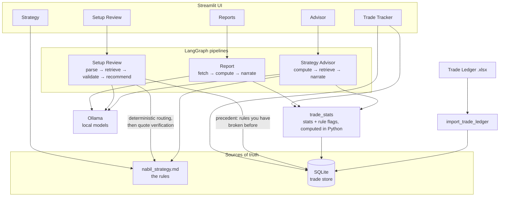

# Confluence

A personal trading assistant that grounds every statement in either your written strategy
document or your own logged trades. It runs locally through Ollama.

One principle runs through all of it:

1. Anything the model states must trace back to a quote from the strategy document or a
   number computed in Python.
2. The model is never asked to recall, estimate or recompute a number.
3. A check that could not be evaluated is reported as such, never as a pass.

It is not a signal generator. It never decides for you.

## 1. System architecture



Two things to read off the diagram:

1. Both pipelines touch the model only after a deterministic step has already decided what
   evidence is in play. Routing and statistics are Python, not prompting.
2. The strategy document and the trade store are the only sources of truth. Everything the
   UI shows resolves back to one of them.

## 2. Setup Review

Answers whether a described setup is consistent with the written rules, without issuing a
trade instruction.

### Stage 1 - restate

An LLM call converts free text into discrete facts and unknowns. Unknowns are restricted to
four categories (RR, whether a pool has been taken, session timing, news risk) so the model
cannot invent open questions.

### Stage 2 - routed matching

The safety core. Instead of one large prompt over the whole document:

1. A deterministic Python router (KEYWORDS -> ROUTING_MAP) maps each item to numbered
   strategy sections. No model is involved in that decision.
2. One narrow call per item-section pair asks for the governing quote and its implication.
3. Every returned quote is verified against the actual section text.
4. Two guards reject low-value answers: a heading guard (a title quoted instead of a rule)
   and a table-row guard (an incomplete table row).

Four statuses, and the distinction between them is the point:

| Status | Meaning |
|---|---|
| `OK` | Evaluated, structured evidence returned |
| `NOT_COVERED` | No usable rule content came back |
| `NOT_ROUTED` | The router intentionally made no call |
| `ERROR` | Runtime or model failure |

`ERROR` is never collapsed into `NOT_COVERED`. A crash must not look like an absence of rules.

### Stage 3 - verdict

Fail-closed. Any `ERROR` means the setup cannot be reviewed. Any outstanding unknown means
`INCOMPLETE`. Only a clean run is `COMPLETE`.

### The two-sided case

Output is split into a supporting case and a risk/invalidation case, composed only from
Stage 2 evidence that has already been verified. No extra model call, so no new
hallucination surface. Three rules govern it:

1. An unreadable `Side` label degrades to `NEUTRAL`, never `SUPPORTS`. A garbled response
   must not become an argument in favour of a trade.
2. Where an item routes to several sections, `RISK` outranks `SUPPORTS`, so a rule flagging
   a problem is never hidden behind a supporting match elsewhere.
3. Guard rejection diagnostics are never shown as trading rationale.

Side classification is gated behind `ENABLE_SIDE_CLASSIFICATION`, default off, because
enabling it changes the match prompt the eval harness measures. With the flag off the
rendered prompt is byte-identical to the committed baseline, so existing eval numbers stay
comparable.

### Precedent from your own record

The case closes with what happened the last times each rule was broken, pulled from the
trade log with no model call.

It is keyed to **rules, not to the setup's own fields**, because Setup Review never learns
this setup's RR, score or session - Stage 1 always classifies those as unknowns. It cannot
say this setup breaks the RR rule; it can say what happened the six times you took sub-3R
trades. That is what turns an unknown into a warning.

The supporting side is called "taken by the book" rather than "precedent in favour":
following every rule does not make a trade a winner, and on the current log the one clean
XAUUSD long lost. A group under five resolved trades says so instead of showing a win rate.
See [precedent.md](docs/precedent.md).

## 3. Trade store

One row per logged trade. Everything downstream reads from here.

The schema was built against the actual Trade Ledger export rather than the proposal in
[product_plan.md](docs/product_plan.md) section 4.2, which the export contradicts. Four
fields that plan proposed (`session`, `htf_zone_grade`, `entry_model`, `sweep_before_fvg`)
are kept nullable and left NULL, because they appear only in free-text notes and inferring
them would put invented data into the store the reports are meant to be grounded in.

The importer cross-checks its own parse against the workbook's Summary sheet before writing
anything and aborts on a mismatch. Re-running replaces rows by source tag rather than
duplicating them.

See [trade_store_and_advisor.md](docs/trade_store_and_advisor.md) for the full schema
decision and its consequences.

## 4. Strategy Advisor

Reports what the logged results say about the written rules.

1. **compute** - statistics and rule-adherence flags, calculated in Python.
2. **retrieve** - only the strategy sections behind flags that actually fired.
3. **narrate** - the model is handed those numbers and that rule text.

Five rule flags, each naming the section that defines the rule: RR below the intraday
minimum (10), sub-60 score taken (13), size above what the score permits (13), full size
with criterion 2 unmet (8), and dead-zone entries (11).

The dead-zone check reports `NOT CHECKABLE` because session is not logged. It is never
reported as clean, for the same reason `ERROR` is not `NOT_COVERED`: absence of evidence is
not evidence of compliance.

Segments under ten resolved trades are marked `INCONCLUSIVE` and the narrator is instructed
to say so, so a rule change cannot be overfitted to a handful of trades.

After narration, every number in the output is compared against the computed findings. The
comparison is numeric, so 22.9 matches a computed 22.90. It is advisory, not a gate.

## 5. Reports

How you actually traded over a day, week or month, from the trade log alone.

1. **fetch** - trades for the date range.
2. **compute** - every number in Python: overall, RR discipline, per instrument, score
   bucket, criterion 2, rule breaches.
3. **narrate** - the model reads the finished numbers back.

Daily, weekly and monthly are one computation over different bounds, not three features.
Unlike the Advisor it does not retrieve strategy text: a period report is grounded in what
you did, and the rules enter only through breach flags that already name their sections.

Watching it narrate produced the clearest lesson in the project: it inverted an RR direction
and mis-ranked an instrument list, and the grounding check caught neither, because every
number involved was real. Both were fixed by computing the statement rather than the
ingredients - the findings now say which way the RR gap runs and name the best and worst
instrument outright. See [reports.md](docs/reports.md).

## 6. Frontend

Five sections:

1. **Setup Review** - the pipeline above, showing verdict, two-sided case and per-item evidence.
2. **Strategy** - the strategy document rendered from source, so what is displayed cannot
   drift from what the pipeline actually reads.
3. **Trade Tracker** - the logged trades, with filters, summary metrics, an equity curve and
   rule-adherence flags recomputed for the current selection.
4. **Reports** - day, week or month over the trade log; every number computed, the written
   report behind a button.
5. **Advisor** - computed statistics and rule flags render immediately; narration sits behind
   a button because it costs a model call.

Navigation is session state rather than `st.tabs`: a tab's selection is client-side and is
lost on rerun, which bounced the user out of the section whenever a filter fired.

## 7. Running it

```powershell
cd d:/confluence-scaffold/confluence
d:/confluence-scaffold/.venv-1/Scripts/python.exe -m streamlit run streamlit_app.py
```

Strategy Advisor, from the command line:

```powershell
d:/confluence-scaffold/.venv-1/Scripts/python.exe scripts/run_strategy_advisor.py
d:/confluence-scaffold/.venv-1/Scripts/python.exe scripts/run_strategy_advisor.py --stats-only
```

Reports, from the command line:

```powershell
d:/confluence-scaffold/.venv-1/Scripts/python.exe scripts/run_report.py --period month --anchor 2026-09-15
d:/confluence-scaffold/.venv-1/Scripts/python.exe scripts/run_report.py --period week --stats-only
```

`--stats-only` skips the model entirely and prints the computed findings.

Backfilling the trade store:

```powershell
d:/confluence-scaffold/.venv-1/Scripts/python.exe scripts/import_trade_ledger.py <path-to-xlsx> [--dry-run]
```

## 8. Project layout

```
app/
  core/        pipeline loader
  graphs/      LangGraph pipelines (setup review, strategy advisor)
  models/      Trade record
  services/    trade store, trade stats, setup review service
  ui/          Streamlit sections and theme
data/
  knowledge_base/  nabil_strategy.md - the rules
  trades/          SQLite store (gitignored)
  eval/            eval run artifacts
docs/          documentation, including the original product plan
scripts/       pipeline entry points, importer, eval harness
tests/         eval ground truth
```

## 9. Quality measurement

Eleven fixed ground-truth items are run repeatedly against Stage 2 and scored for section
routing, quote precision, unverified quotes and heading quotes. Any change to the match
prompt must be re-baselined through this harness before it is promoted to default. See
[eval_pipeline_and_results.md](docs/eval_pipeline_and_results.md).

## 10. Current status

Built and working:

1. Setup Review, end to end, as a LangGraph pipeline with the two-sided case.
2. Trade store, with the ledger backfilled and validated against the workbook's own totals.
3. Strategy Advisor, critique mode, with computed stats and rule flags.
4. Reports: daily, weekly and monthly over the trade log.
5. Precedent from the trade log inside Setup Review.
6. Multiple strategies, each with its own routing, thresholds and trade history.
7. Streamlit frontend with all five sections.

**The MVP as defined in [product_plan.md](docs/product_plan.md) section 6 is complete.**

Not built:

1. **Similar past trades inside Setup Review.** The store supports it; the definition of
   "similar" is open, because the original version depends on those unlogged fields.
3. Segment-level advisor critiques and cold-start mode, both deliberately deferred.

## 11. Environment notes

1. `OLLAMA_MODELS` may point somewhere other than the store holding this project's models
   (`qwen3:8b`, `deepseek-r1:8b`). Ollama started without the right override serves the
   wrong set.
2. The default two-model configuration (`deepseek-r1:8b` for Stage 1, `qwen3:8b` for Stage 2,
   pinned by `keep_alive`) needs roughly 10GB of VRAM. On an 8GB card this terminates
   llama-server. Point both at one model until the two-tier split is worth the swap cost.

## 12. Documentation

1. [foundations.md](docs/foundations.md) - **start here.** How each technology works from the
   ground up (LLMs, prompting, grounding, RAG and embeddings, LangGraph, SQLite, Streamlit)
   and exactly where this codebase uses it and why.
2. [product_plan.md](docs/product_plan.md) - the original plan: vision, decisions, tech-stack
   rationale, MVP definition, roadmap and open questions.
3. [app_documentation.md](docs/app_documentation.md) - operator reference: what each app
   section does, every configuration variable, how to add a strategy.
4. [reports.md](docs/reports.md) - the period report, and what watching it narrate taught
   about asking a model to rank or subtract.
5. [precedent.md](docs/precedent.md) - why precedent is keyed to rules rather than to the
   setup, and how an unknown becomes a warning.
6. [retrieval.md](docs/retrieval.md) - **Epic J in full**: the reference corpus, chunking,
   embedding and search, why there is no Chroma, a measured case of dense retrieval missing
   on vocabulary, and how to build what remains.
7. [trade_store_and_advisor.md](docs/trade_store_and_advisor.md) - schema decisions, the
   importer's self-check and the advisor's flags.
8. [eval_pipeline_and_results.md](docs/eval_pipeline_and_results.md) - the eval harness and
   measured results.

---

*Personal trading framework. Not financial advice. Every threshold in the strategy document
is a hypothesis from a small sample.*
