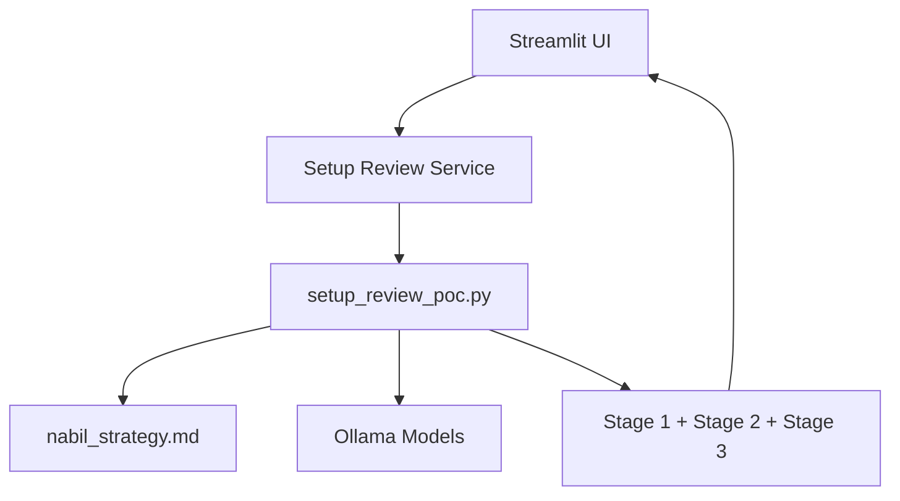

# APP documentation

## 1. What this app is

This app is a Streamlit frontend over the Setup Review pipeline.

Its job is to:

1. Accept a trading setup description.
2. Evaluate that setup against the strategy document.
3. Return a structured, fail-safe result with explicit statuses.

It is intentionally safety-first:

1. Runtime/model failures are marked as ERROR.
2. ERROR is never treated as NOT_COVERED.
3. Final verdict is fail-closed when required checks fail.

## 2. Why it was implemented this way

The original risk in LLM-only evaluation was ambiguity and hidden failure modes.

This implementation reduces that risk by:

1. Deterministic routing in Python.
2. Per-item, section-scoped model calls.
3. Strict output normalization and verification.
4. Explicit status model and Stage 3 gate.

Result:

1. You can inspect every item and its governing section.
2. You can separate business logic misses from runtime faults.
3. You can benchmark quality and runtime with a reproducible eval harness.

## 3. High-level architecture



What each block is for:

1. Streamlit UI: operator interaction and result display.
2. Service layer: calls pipeline and returns structured objects to UI.
3. setup_review_poc.py: core matching logic and safety behavior.
4. Strategy markdown: source-of-truth rules.
5. Ollama: local model inference runtime.

## 4. Request lifecycle

When the user clicks Run setup review:

1. UI reads setup text.
2. Service loads and caches the pipeline module.
3. Stage 1 model restates facts and unknowns.
4. Stage 2 routes each item and evaluates against routed sections.
5. Stage 2 validates quote grounding and normalizes response shape.
6. Stage 3 produces final decision status.
7. UI displays runtime, status counts, and per-item evidence.

## 5. Core files and what they are for

1. streamlit_app.py
   - Frontend page for Setup Review MVP.
   - Shows metrics, Stage 1 raw output, Stage 2 item output, Stage 3 verdict.

2. app/services/setup_review_service.py
   - Runtime bridge between UI and pipeline script.
   - Creates model clients, runs evaluation, returns typed result objects.

3. scripts/setup_review_poc.py
   - Core logic implementation.
   - Includes routing, parsing, matching, retries, normalization, verification, and verdict gating.

4. data/knowledge_base/nabil_strategy.md
   - Rule source of truth used for section parsing and quote verification.

## 6. Status model and why it exists

The app uses four statuses:

1. OK
   - Item evaluated successfully with parseable structured output.

2. NOT_COVERED
   - Routed section does not provide governing rule content for the item.

3. NOT_ROUTED
   - Deterministic router intentionally made no model call.

4. ERROR
   - Technical/runtime failure or malformed model output.

Purpose:

1. Prevent silent false negatives.
2. Make failure modes observable.
3. Keep final trade verdict safe under uncertainty.

## 7. Implementation details in setup_review_poc.py

Main components and purpose:

1. route()
   - Maps item text to strategy section numbers using KEYWORDS and ROUTING_MAP.

2. parse_numbered_h2_sections()
   - Builds a section map from numbered H2 headings.

3. parse_restate_output()
   - Extracts facts and unknowns from Stage 1 output robustly.

4. _invoke_with_retry()
   - Handles retries, timeout checks, length-cap diagnostics, and controlled retry escalation.

5. _normalize_structured_response()
   - Enforces strict output shape and heading guard behavior.

6. find_unverified_quotes()
   - Confirms returned quote belongs to routed section source text.

7. match_one_fact() and match_one_unknown()
   - Execute per-item routed matching and aggregate status.

8. build_stage3_verdict()
   - Converts item-level outputs into final fail-safe decision state.

## 8. Runtime controls and purpose

Important controls:

1. /no_think in match prompts
   - Reduces hidden reasoning-token burn and latency.

2. keep_alive + warmup
   - Reduces cold-start and reload overhead.

3. num_predict and num_predict_retry
   - Controls output length and allows one controlled rescue on length-capped empty output.

4. timeout and retries
   - Prevents hanging calls and captures deterministic failure semantics.

5. section-focused excerpts + per-section num_ctx
   - Reduces prompt load and improves runtime efficiency.

## 9. Frontend behavior

UI behavior in streamlit_app.py:

1. Text area for setup description.
2. Run button triggers full pipeline execution.
3. Summary metrics:
   - runtime
   - OK count
   - NOT_COVERED count
   - ERROR count
   - NOT_ROUTED count
4. Stage 3 verdict shown first.
5. Stage 1 raw output expandable.
6. Stage 2 per-item details expandable.

Purpose:

1. Give quick top-line health (counts + verdict).
2. Preserve full traceability for diagnostics.

## 10. Evaluation and quality measurement

The app pipeline is accompanied by reproducible evaluation scripts.

1. tests/ground_truth.py
   - Fixed 11-item answer key.

2. scripts/eval_match.py
   - Runs 5 attempts per item and writes JSON evidence.

3. scripts/score_eval.py
   - Computes section hit, row hit, unverified, heading quotes.

Purpose:

1. Compare baseline and changes objectively.
2. Detect regressions before adopting prompt/runtime changes.

## 11. How to run

Run the app:

```powershell
cd d:/confluence-scaffold/confluence
d:/confluence-scaffold/.venv-1/Scripts/python.exe -m streamlit run streamlit_app.py
```

Open:

1. http://localhost:8501

## 12. Known limits

1. Row-level quote precision can still vary by section complexity.
2. Some runs may require length-cap retry escalation for specific items.
3. Current MVP is single-page, single-flow (Setup Review only).

## 13. Next implementation candidates

1. Persist run history in data/ for side-by-side comparisons in UI.
2. Add inline quality flags for unverified or heading-like quote outcomes.
3. Add operator presets for speed-first vs quality-first runtime settings.
